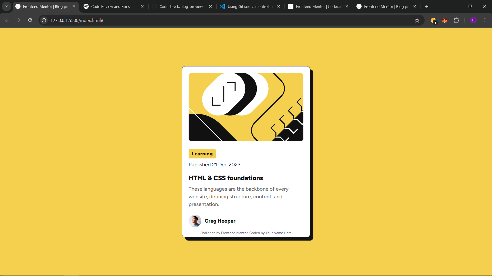

# Frontend Mentor - Blog preview card solution

This is a solution to the [Blog preview card challenge on Frontend Mentor](https://www.frontendmentor.io/challenges/blog-preview-card-ckPaj01IcS). Frontend Mentor challenges help you improve your coding skills by building realistic projects. 

## Table of contents

- [Overview](#overview)
  - [The challenge](#the-challenge)
  - [Screenshot](#screenshot)
  - [Links](#links)
- [My process](#my-process)
  - [Built with](#built-with)
  - [What I learned](#what-i-learned)

- [Author](#author)

## Overview

### The challenge

Users should be able to:

- See hover and focus states for all interactive elements on the page

### Screenshot


The result of my Blog card challenge
### Links

- Live Site URL: [My live site URL ](https://codecblvck.github.io/blog-preview-card-main/)

## My process

### Built with

- Semantic HTML5 markup
- CSS custom properties
- Flex-box

### What I learned

### **1. Font Integration and Preloading Fonts**
I also explored **custom font integration** using local font files and **preloading** fonts for performance optimization. Preloading helps to load the font earlier, improving the user experience by preventing the browser from rendering text with fallback fonts before the custom font is available.

By using **preload**, I made sure that the fonts would load as quickly as possible when the page loads. This is especially important for fonts that affect the layout or visual design of a page.

**Code Example (Preloading Fonts in HTML):**
```html
<link rel="preload" href="path/to/font.woff2" as="font" type="font/woff2" crossorigin="anonymous">
```
### **2. HTML Structure and Accessibility**
Throughout the project, I focused on **semantic HTML** to ensure my pages are not only SEO-friendly but also accessible to users with disabilities. By using semantic HTML tags like `<article>`, `<section>`, `<header>`, and `<footer>`, I made sure the structure of the page is easy to understand for both browsers and assistive technologies.

Good accessibility practices also include:
- Providing **meaningful alternative text** for images.
- Using a **logical heading structure** (`<h1>`, `<h2>`, etc.).
- Structuring content in a clear, consistent way.

**Code Example (Semantic HTML for Accessibility):**
```html
  <section>
    <header>
      <h2>HTML & CSS Foundations</h2>
    </header>
    <p class="post-excerpt">
      These languages are the backbone of every website, defining structure, content, and presentation.
    </p>
  </section>
```

## Author

- Frontend Mentor - [@Codecblvck](https://www.frontendmentor.io/profile/Codecblvck)
- Twitter - [@Codec_blvck](https://x.com/Codec_blvck)